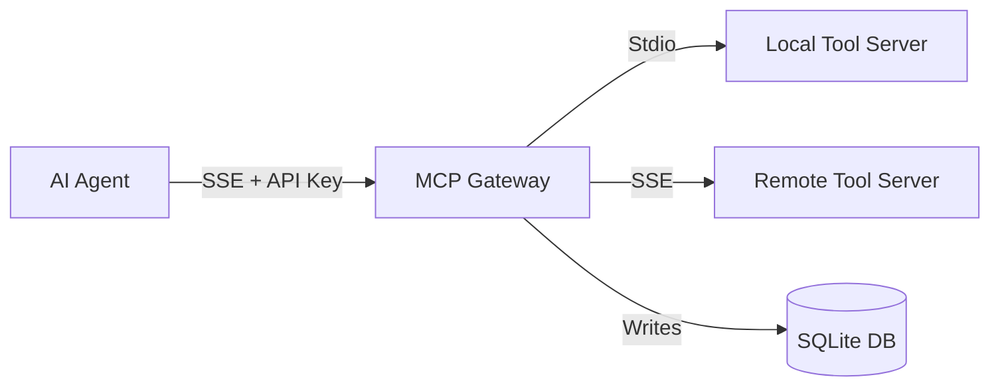

# MCP Gateway Platform

A robust, secure, and observable gateway for connecting AI Agents to internal tools via the Model Context Protocol (MCP).

## Features

- **Centralized Registry**: Manage all your downstream MCP servers (Stdio, SSE) in one place.
- **Security & RBAC**: API Key authentication and granular Role-Based Access Control (RBAC) for tool access.
- **Observability**: Built-in logging, metrics, and dashboard API.
- **Reliability**: Automatic retries and configurable timeouts for downstream calls.
- **Standard Interface**: Exposes a standard MCP SSE endpoint for upstream agents.

## Getting Started

### Prerequisites

- [Bun](https://bun.sh) (v1.0+)
- SQLite (Bundled with Bun)

### Installation

```bash
# Install dependencies
bun install

# Start the server
bun run src/server.ts
```

The server will start on port `3000`.

## Architecture



## API Reference

### 1. Connect to Gateway (MCP)

**Endpoint**: `GET /mcp/sse`

**Authentication**:
- Header: `Authorization: Bearer <your-api-key>`
- Query Param: `?apiKey=<your-api-key>`

**Example**:
```bash
curl -N "http://localhost:3000/mcp/sse?apiKey=sk-admin-secret-key"
```

### 2. Registry Management

- **List Servers**: `GET /api/registry/servers`
- **Register Server**: `POST /api/registry/servers`
  ```json
  {
    "name": "my-server",
    "transport_type": "stdio",
    "config": { "command": "python3", "args": ["main.py"] }
  }
  ```

### 3. Observability

- **Get Stats**: `GET /api/observability/stats`
  - Returns: Total calls, Success rate, Avg latency.
- **Get Recent Logs**: `GET /api/observability/logs`
  - Returns: Last 50 tool execution logs.

## Security

### Default Access
- **Admin Key**: `sk-admin-secret-key` (Created on first run)
- **Default Role**: `admin` (Has access to `*:*`)

### Policies
Policies define which roles can access which resources (`server:tool`).
- Wildcards (`*`) are supported.
- Example: Role `analyst` fails to access `payment:charge` if no policy exists.

## Database

The gateway uses SQLite structured in 3 parts:
1. `registry`: `mcp_servers`, `mcp_tools`.
2. `policy`: `api_keys`, `policies`.
3. `logging`: `call_logs`.

## Development

- **Source**: `src/mcp-gateway/`
- **Main Entry**: `src/server.ts`
